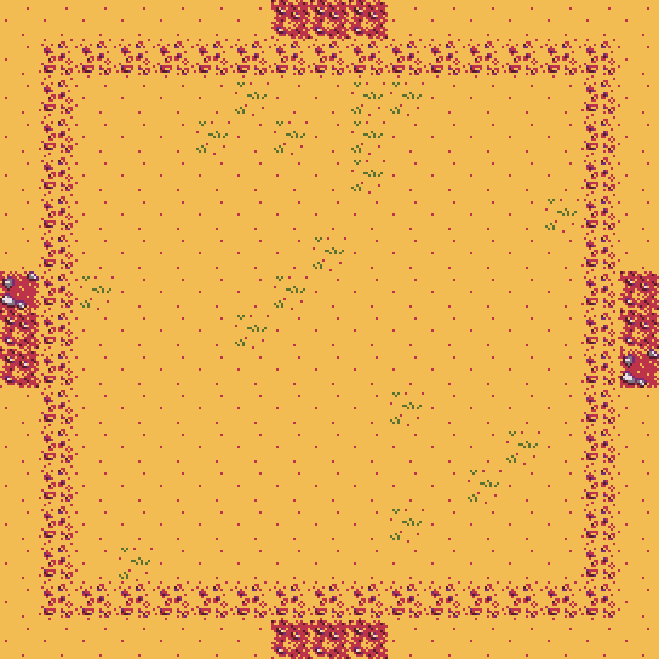
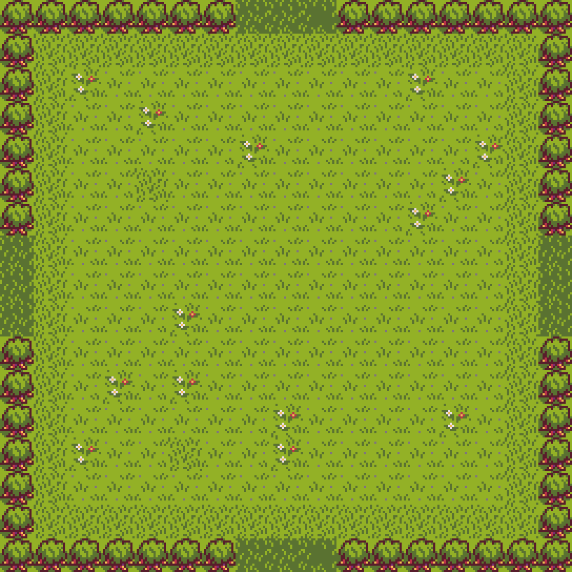
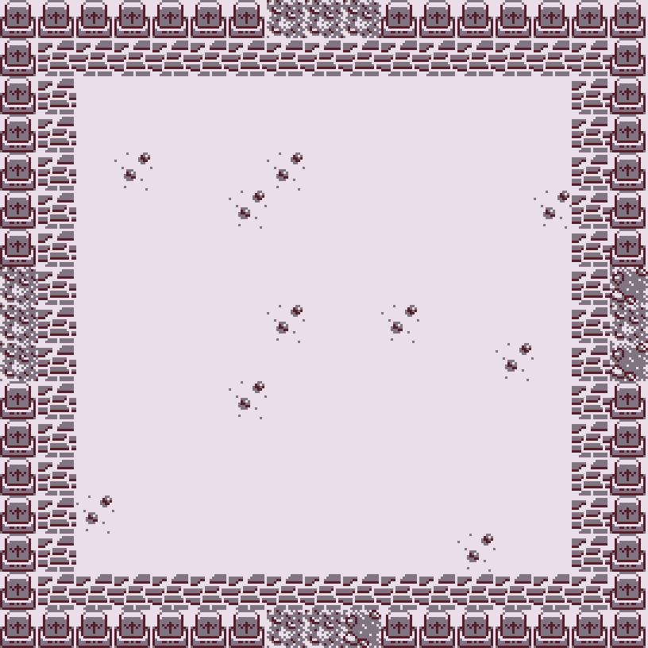

# REY DE LA PRADERA

## Equipo de desarrollo

- Lezcano, Facundo 
- Scheffelaar Klotz, Germán
- Gutierrez, Eric 
- Flores, Matias

## Capturas

  

  

  

## Reglas de Juego / Instrucciones

(Escribirlas)

## Otros

- Programación con Objetos 1 C2
- Versión de wollok
- Una vez terminado, no tenemos problemas en que el repositorio sea público / queremos manternerlo privado
