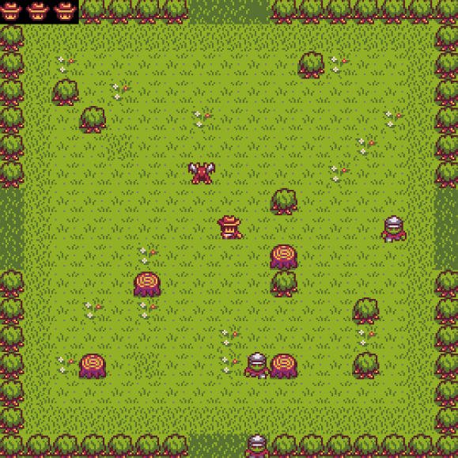
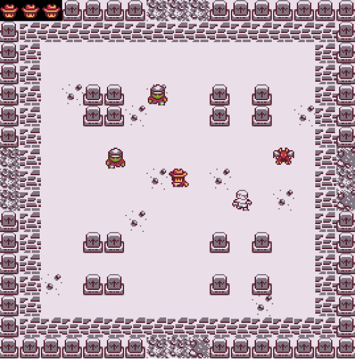

# REY DE LA PRADERA

## Equipo de desarrollo

- Lezcano, Facundo 
- Scheffelaar Klotz, Germán
- Gutierrez, Eric 
- Flores, Matias

## Capturas

 ### Niveles

  

  

  

### Enemigos
| Monstruo | Descripción |
| :---: | :--- | 
| **Zombie Básico**  | El enemigo más débil, eso no quita que con un simple rasguño la cosa se pueda ver fea. |
| **Acorazado**  | Enemigo blindado. Luego de recibir cierta cantidad de daño, cubre su cuerpo con espinas. |
| **Minotauro**  | Una gran bestia capaz de resistir mucho daño. |
| **Gargola**  | Enemigo volador y veloz, capaz de sobrevolar cualquier obstáculo. |
| **Momia**  | Un enemigo algo lento, aunque compite con el minotauro por ver quién resiste más daño. |
| **Vampiro**  |Secuaces número 1 del Rey Lich. |
| **Rey Lich**  | La fuente de toda la corrupción y el causante de todo. Este antiguo hechicero, tras alcanzar la inmortalidad a través de la nigromancia, busca someter el mundo a un invierno eterno.. |

## Reglas de Juego / Instrucciones

(Escribirlas)

## Otros

- Programación con Objetos 1 C2
- Versión de wollok
- Una vez terminado, no tenemos problemas en que el repositorio sea público / queremos manternerlo privado
